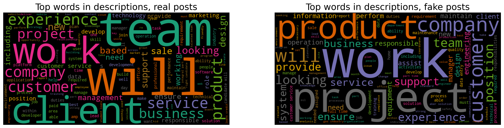
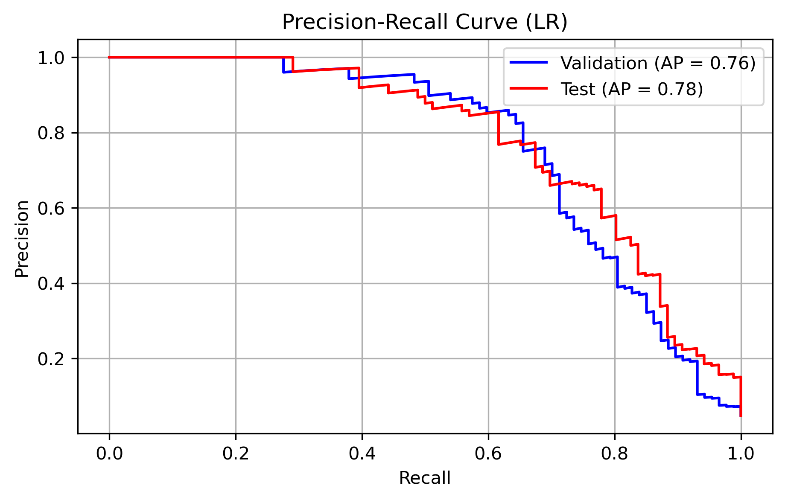
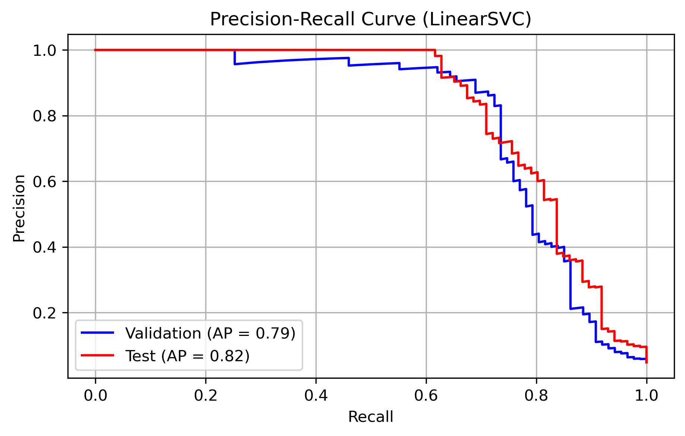
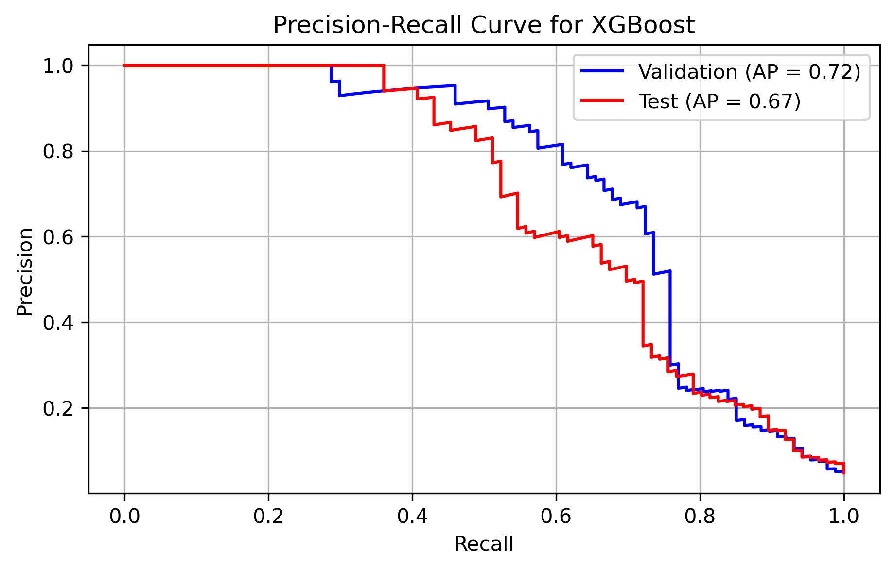
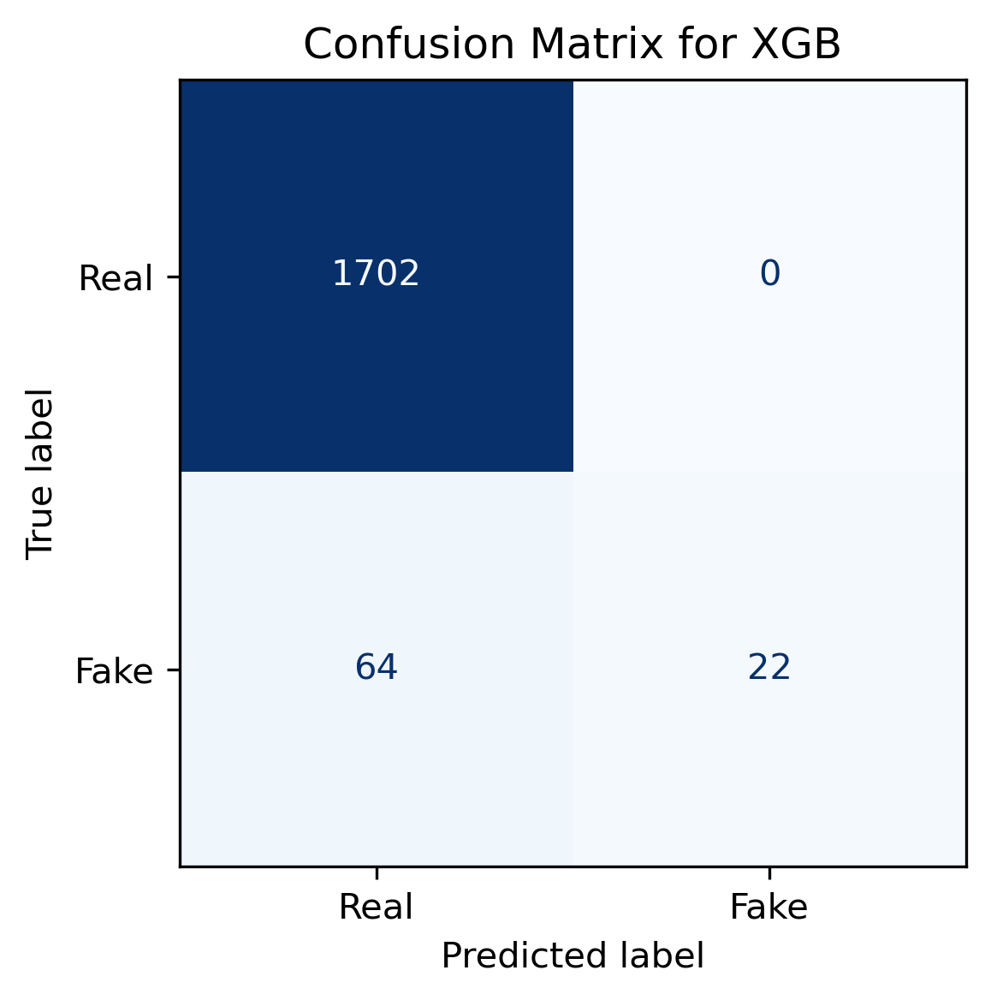
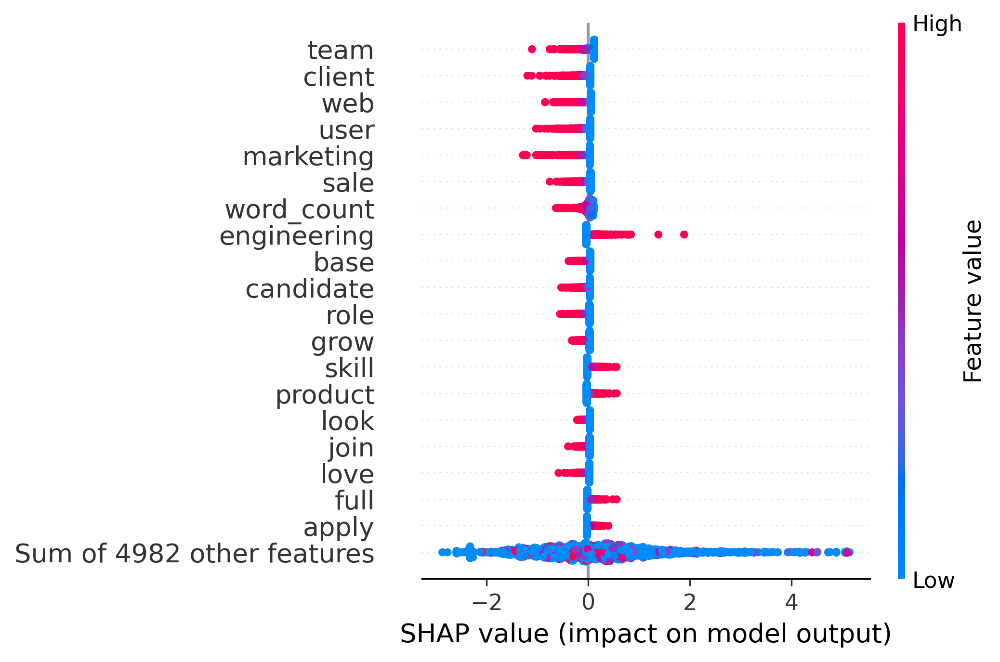
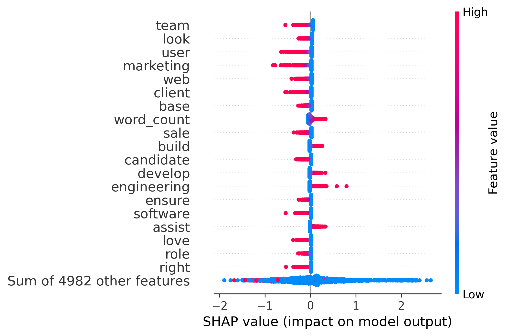

# 💼 Real vs Fake Job Postings Classification

This project investigates the classification of job postings into **real vs. fake** categories using Natural Language Processing (NLP) and machine learning. The aim is to support job platforms and users in identifying fraudulent job postings by analyzing both structured and unstructured data.

---

## 📦 Project Summary

We trained and evaluated three supervised learning models:

- **Logistic Regression** - a linear and interpretable baseline.
- **Support Vector Machine (SVM)** - a linear model optimized for margin-based class separation.
- **XGBoost** - a non-linear, ensemble-based classifier capable of capturing feature interactions.

While all three models performed well, Logistic Regression offered the best balance of predictive accuracy, recall, and interpretability. SVM achieved the highest AP score, and XGBoost delivered perfect precision but at the cost of lower recall.

---

## 📘 Table of Contents
- [Technologies](#technologies)
- [Research Questions](#research-questions)
- [Dataset](#dataset)
- [EDA](#eda)
- [Text Preprocessing](#text-preprocessing)
- [Modeling and Evaluation](#modeling-and-evaluation)
- [Model Explainability](#model-explainability)
- [Conclusion](#conclusion)
- [Resources](#resources)

---

## ⚙️ Technologies

- Python
- pandas, numpy, scikit-learn, xgboost, matplotlib, seaborn
- spaCy (lemmatization)
- SHAP (model explainability)
- TF-IDF vectorization

---

## ❓ Research Questions

This project investigates the following core questions:

1. **Can we accurately classify job postings as real or fake?**  
   Using natural language and structured features, can machine learning models reliably distinguish fraudulent listings?

2. **What patterns and features differentiate fake from real job posts?**  
   Does word count matter? Are there specific terms, tones, or structural traits that are more common in fake postings?

3. **How do the models make their predictions?**  
   By applying SHAP explainability techniques, can we understand which features most influence the model's decision and validate that the logic aligns with human intuition?

---

## 🗃 Dataset

- **Source**: [Kaggle - Fake Job Postings](https://www.kaggle.com/datasets/shivamb/real-or-fake-fake-jobposting-prediction)
- **Size**: 17,880 job postings
- **Target Variable**: `fraudulent` (0 = Real, 1 = Fake)
- **Key Features Used**: `description`, `requirements`, `telecommuting`, `has_company_logo`, `has_questions`, `employment_type`, `industry`

---

## 📊 EDA

The dataset is highly imbalanced with only **4.8%** labeled as fake.

- **Text length**: Real job postings are generally longer and more detailed than fake ones.
  - **Median word count**: 147 for real vs. 113.5 for fake postings
  - **Maximum word count**: 2,115 for real vs. 1,183 for fake
  - **Conclusion**: Fake postings are typically shorter and less descriptive, making word count a useful feature for classification.
  
- **Word clouds**: Fake postings use sales-like or vague language (e.g., "hiring," "opportunity") vs. real postings that include more specific job-related terms.



- **Top job titles**: The most frequent titles are **English Teacher** and **Customer Service Associate**.

- **Top locations**: The most common job locations are **London**, **New York**, and **San Francisco**.

---

## 🧹 Text Preprocessing

Text and feature preparation involved the following steps:

- **Column removal**: Features with more than **15% missing values** were dropped. These included `salary_range`, `department`, `required_education`, `benefits`, `required_experience`, and others. This helped reduce noise and ensure reliability of the remaining features.
  
- **Duplicate removal**: Duplicate job postings were dropped to avoid data redundancy and bias.

- **Feature engineering**:
  - A new feature `word_count` was created based on the length of the job description.
  - `word_count` was then scaled using **Min-Max normalization** to align it with the TF-IDF feature range.

- **Data splitting**:
  - Before cleaning and vectorizing the text, the data was split into **training**, **validation**, and **test subsets** using **stratified sampling** to preserve the proportion of real and fake job posts.
  - This step was crucial to prevent **data leakage** during TF-IDF vectorization.

- **Text cleaning and token processing**:
  - HTML tags and punctuation were removed
  - Custom stopword filtering was applied (with key domain words like “full,” “part,” etc. preserved)
  - Lemmatization was performed using **spaCy**

- **Text vectorization**:
  - TF-IDF vectorization was applied to the cleaned `description` and `requirements` fields using **unigrams and bigrams**
  - The top **5,000** TF-IDF features were retained for modeling

---

## 🤖 Modeling and Evaluation

In fraud detection, **recall** is often prioritized over precision or accuracy. Identifying as many fake postings as possible is essential to protect users from scams or phishing attempts. Therefore, in this project, we focused on **maximizing recall** during model training and evaluation.

To make the project more representative and robust, we built three models: **Logistic Regression**, **Linear SVM**, and **XGBoost**. It is standard practice in data science to evaluate multiple models before making a final selection. The choice of models was deliberate:

- **Logistic Regression** provides a simple, fast, and interpretable baseline. It is especially effective with sparse feature matrices like TF-IDF. We tuned it using **randomized search** and applied `class_weight="balanced"` to address class imbalance and improve recall — an important metric in fraud detection, as it reflects how many fake postings the model successfully captures.

- **SVM (LinearSVC)** focuses on **margin maximization**, which improves class separation and often leads to high generalization performance.

- **XGBoost** is a tree-based ensemble method known for its flexibility in capturing **non-linear relationships** and **feature interactions**.

Comparing these models allows us to validate performance consistency, explore different algorithmic perspectives, and ultimately select the most suitable model for the task.

### ⚙️ Model Building for Recall

- **Logistic Regression**:
  - Built with `class_weight="balanced"` to address class imbalance
  - Tuned using **RandomizedSearchCV** with `scoring="recall"`
  - Best model selected based on 5-fold cross-validated recall
  ```python
  log_reg_m = LogisticRegression(max_iter=1000, solver="liblinear", class_weight="balanced")
  param_dist = {"C": np.logspace(-3, 2, 10)}
  random_search = RandomizedSearchCV(log_reg_m, param_distributions=param_dist, n_iter=5,
                                     cv=5, scoring="recall", verbose=1, n_jobs=-1, random_state=42)
  random_search.fit(X_train_combined, y_train)
  best_log_reg_m = random_search.best_estimator_
  ```

- **SVM (LinearSVC)**:
  - Trained with `class_weight="balanced"` to give more importance to the minority class
  ```python
  svm_m = LinearSVC(random_state=42, max_iter=5000, class_weight="balanced")
  svm_m.fit(X_train_combined, y_train)
  ```

- **XGBoost**:
  - Used `scale_pos_weight` to penalize misclassification of fake postings
  - Tuned using **RandomizedSearchCV** with `scoring="recall"`
  ```python
  xgb_model = XGBClassifier(objective='binary:logistic', eval_metric="logloss", 
                            random_state=42, scale_pos_weight=scale_pos_weight)
  param_grid = {
      "n_estimators": [100, 200],
      "max_depth": [3, 6],
      "learning_rate": [0.05, 0.1],
      "subsample": [0.8, 1.0],
      "colsample_bytree": [0.8, 1.0]
  }
  random_search = RandomizedSearchCV(estimator=xgb_model, param_distributions=param_grid, n_iter=8,
                                     scoring="recall", cv=3, verbose=1, n_jobs=-1, random_state=42)
  random_search.fit(X_train_combined, y_train)
  best_xgb = random_search.best_estimator_
  ```

### 🔢 Performance Overview

| Metric                 | Logistic Regression | SVM (LinearSVC) | XGBoost |
|------------------------|---------------------|------------------|---------|
| Accuracy               | 98%                 | 96%              | 96%     |
| Fake Precision         | 98%                 | 98%              | 100%    |
| Fake Recall            | 64%                 | 59%              | 55%     |
| Fake F1-score          | 0.77                | 0.74             | 0.71    |
| Avg. Precision (Test)  | 0.83                | 0.85             | 0.67    |

### 📉 Precision-Recall Curves

The precision-recall curve shows model behavior across all classification thresholds. It helps us tune thresholds and assess model **stability** and **generalization**. We plot both **validation** and **test** curves to:
- Evaluate how well the model generalizes
- Detect signs of overfitting

> **Average Precision (AP)** summarizes the entire precision-recall curve. It is especially useful in **imbalanced classification** problems like this one.

- **Logistic Regression**: The AP scores for validation and test are close, suggesting strong generalization. While not the highest, the recall is strong and the model is simple and interpretable.
- **SVM**: Achieved the highest AP (0.85) and very similar scores on validation and test sets, indicating excellent generalization. It correctly identified **69 fake postings** (TP) and missed 17 (FN), achieving a **recall of 0.80**.
- **XGBoost**: Tuned for recall, yet still struggled to identify many fake postings. Its recall is low, and AP drops from **0.72** (validation) to **0.67** (test), indicating weaker generalization. Lowering the threshold might improve recall but isn’t needed since the other models already perform well.

<div align="center">
  
  
</div>

<div align="center" style="margin-top: 20px;">
  
</div>

### 📊 Confusion Matrices

Confusion matrices display the **actual counts** of correct and incorrect predictions. They are key to calculating recall and precision.

- **Logistic Regression**: Correctly identified **72 fake postings** (TP), and missed **14** (FN). Recall = 72 / (72 + 14) = **0.837** - a strong result for fraud detection.
- **SVM**: Correctly identified **69 fakes**, missed **17**, giving recall = **0.80**.
- **XGBoost**: High precision but poor recall - many fake jobs go undetected.

<div align="center">
  
  
  
</div>

### ✅ Final Model Selection

All three models demonstrate **high accuracy**, but our objective was to maximize **recall** to reduce the number of missed fake job postings.

- **Logistic Regression** stands out for its strong recall, simple design, and consistent generalization performance.
- **SVM** achieved the highest AP score and very close recall but is slightly less interpretable.
- **XGBoost** provided perfect precision but failed to recall many fake listings.

**Final Choice**: **Logistic Regression** was selected as the best model due to its balance of recall, interpretability, and generalization — making it ideal for deployment in fraud detection scenarios.

---

## 🧠 Model Explainability

Understanding how models make predictions is critical in high-stakes tasks like fraud detection. We used **SHAP (SHapley Additive exPlanations)** to explain the predictions made by our Logistic Regression and SVM models. SHAP provides both local (per-sample) and global (overall) interpretability by showing how each feature contributes to predictions.

- **SHAP value**: quantifies the effect of a feature on the model's prediction.
- **Color**: red = high feature value; blue = low feature value.

---

### 🧪 Logistic Regression: Feature Impact in Log-Odds

Logistic Regression predicts log-odds, and SHAP values here are also in **log-odds units**. A positive SHAP value means the feature pushes the prediction toward the "Fake" class; a negative value pushes it toward "Real."

- The SHAP summary plot below shows the most influential features across the test set.
- Words like `team`, `client`, `web`, `user`, `marketing`, and `word_count`—when present—**push the model toward predicting 'Real'**.
- When these words are absent or low-frequency (blue), the prediction shifts toward "Fake."



---

### 📐 SVM: Margin-Based Feature Influence

For the SVM model, SHAP values reflect the contribution to the **distance from the decision boundary (margin)** rather than log-odds. Each dot still represents a feature’s impact on one sample.

- Red = high value (e.g., word present, long word count)
- Blue = low value (word absent, short description)

The SVM model agrees with Logistic Regression on features like `team`, `look`, and `user`-their presence strongly indicates a real post. However, **`word_count` behaves differently** in the SVM model:
- Longer posts (high word count) **push predictions toward 'Fake'**
- Shorter posts (low word count) **nudge toward 'Real'**



---

### 🔍 Why the Disagreement on `word_count`?

In EDA, we found that **real postings tend to be longer**, with:
- Median word count: 147 (real) vs. 113.5 (fake)
- Max word count: 2,115 (real) vs. 1,183 (fake)

Yet SVM interprets longer posts as more likely fake. This discrepancy may arise because:
- Some fake posts mimic real formatting but use **long, generic filler text**.
- SVM focuses on **margin maximization**, possibly picking up on subtle patterns that Logistic Regression smooths over.

---

### 🧾 Takeaway

- **SHAP helped validate** the linguistic features we engineered.
- It also revealed subtle differences in how models interpret those features.
- When model performance is close, **explainability and domain knowledge** guide model selection.

This insight confirmed our choice of **Logistic Regression** as the final model - not just for its recall and performance, but because its behavior **aligned more intuitively with EDA** and was easier to justify to stakeholders.

---
## 🎯 General Conclusion

This project explored the challenge of classifying job postings as real or fake using natural language processing and machine learning techniques. By combining text-based features (TF-IDF, word count) with structured metadata, we developed models that help identify potentially fraudulent listings.

We trained and evaluated three models - **Logistic Regression**, **SVM**, and **XGBoost** - with a strong focus on **recall**, given the importance of detecting fake postings to protect users. After extensive tuning and performance comparison, **Logistic Regression** was selected as the final model due to its strong recall, consistent generalization, and interpretability.

### ✅ Answers to Research Questions

1. **Can we accurately classify job postings as real or fake?**  
   Yes. All three models achieved high classification performance, with accuracies near or above 96% and solid recall for the fake class - the most challenging target.

2. **What patterns and features differentiate fake from real job posts?**  
   Real postings tend to be longer and use more specific job-related language. In contrast, fake postings often use vague or overly generic terms like “opportunity” or “hiring.” EDA and SHAP analysis revealed that certain words and the overall length of the post are strong indicators of authenticity.

3. **How do the models make their predictions?**  
   Using SHAP explainability, we visualized how individual features influenced predictions. The most impactful features included keywords like “team,” “client,” and “user,” as well as `word_count`. The models learned different patterns from the same data - highlighting the importance of aligning model behavior with domain knowledge when making a final selection.

---

This analysis demonstrates how machine learning can support automated fraud detection in job platforms and reinforces the value of combining predictive performance with interpretability to guide ethical and effective decision-making.

---

## 📎 Resources

- [Notebook](Real_Fake_Job_Postings_update.ipynb)
- [Report (PDF)](Real_Fale_Job_Postings_Report.pdf)
